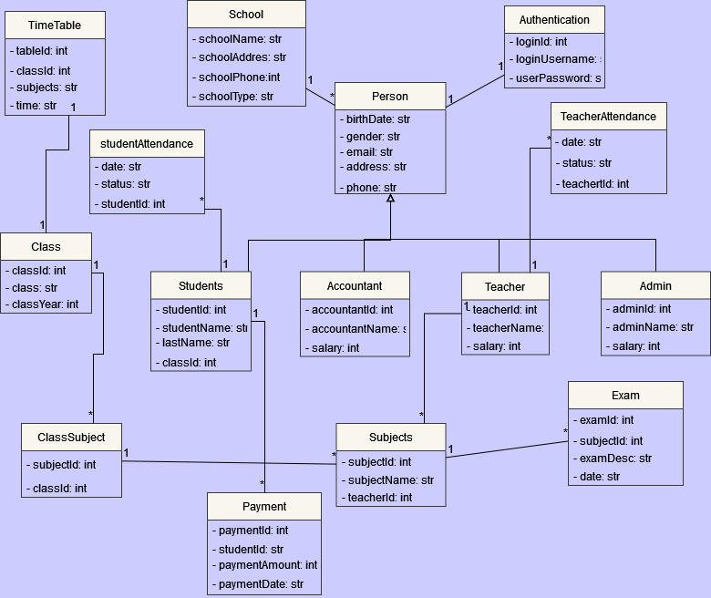

# School Management System
 
## Overview
This School Management System is created for a private school, which needs to keep track of the student information and fees, it has multiple levels of access, different types of users have different roles, students can view their timetable and pay fees while the principal can view and modify other users information and other principal specific roles.
 
## Project targets:
This project is built specifically for a private school, but can also be used by other schools with little change if required
 
### This project can be used by:
1. Small school
1. Medium school
 
## Hardware and System Requirements:
### Hardware
1. computer
1. server
 
### Software
#### Operating System
1. windows 7 and above

## Team
#### Biner Omer
responsible for Building and Designing the project.
* #### Zeynab Hamad
    * responsible for Building and Designing the project.
* #### Abdullah Ahmad
    * responsible for Building and Designing the project.
* #### Darya Naji
    * responsible for Building and Designing the project.
* #### Mohammed Malah
    * responsible for Building and Designing the project.
* #### Naz Farid
    * responsible for Building and Designing the project.
 
## Goals
* Allow full and easy control for all the parties
* Allows complete control of the different activities
* Less prone to human error
* More productive
 
## Application view flow
Showing the program view after successful login \

 
 
 
## Class Diagram

 
 
## Usecase Diagram

 
## Application Actors
 
* Principal
* Admin
* Teacher
* Student
 
## Functionality
Note:: all user should have account and it can log in and log out from account
### Principal
* Mark teacher attendance
* View teacher performance
* View Student performance
* Update student info
* Update teacher info
* View and modify staff attendance
 
 
### Admin
* View and modify Staff  attendance
*View mark
* Generate student/staff report
* Manage User
    * Change user password
    * Manage student
    * Manage teacher
    * View and modify teacher attendance
    * View and modify student attendance
* Generate Teacher Report
* Create Time Table
 
 
### Teacher
* Mark student attendance
* Create exam
* Grade Student
* Generate student Report
 
### Student
* View time table
* View attendance
* View marks
* Pay fee
 
### Accountant
* Manage student finance
* Manage teacher/staff finance
 
 
## Maintenance and support
The project will be maintained by the team until all the initially gathered requirements are deployed, building new functionalities after the final deployment requires more budget, but building extra functionality during development can be done, if the core requirements are not changed that require a new structure, the project will be supported for bug fixes for one month after deployment.
 
## Project Timeline
The expected development period of the project is 24 weeks, the project will be deployed by week 10 but with only the required features that were requested by dr.Polla Fattah, the students will not be able to use the system first until week 15.

 
 
## Software Process
We use the iterative software development process,because we need to implement a small set of the software requirements until the system is complete.
The iterative software model develops a system through building small portions of all the features. This helps to meet initial scope quickly and release it for feedback
 
## Tools and Programs used
 
* Programming languages:
    * Java
* Dbms:
   * Mysql
* Ide:
   * Intellij
* Tools:
    * Git
    * Github
    * Google docs
    * diagrams.net
    

 
## Contact us
* Biner Omer(bineromer19@gmail.com)
* Zeynab Hamad(Zaynabhamad950@gmail.com)
* Abdullah Ahmad(Abdullaahmadsheikh@gmail.com)
* Darya Naji(Daaryaa.naji@gmail.com)
* Mohammed Malah(muhammedslahqadir@gmail.com)
* Naz Farid(naz.f.kamal@gmail.com)
 